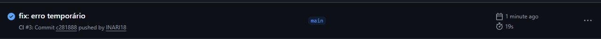

# Respostas

## 1. Como a pipeline é disparada no GitHub Actions?

A pipeline é disparada automaticamente por eventos/atividades que o GitHub Actions
captura do repositório. No arquivo `ci.yml`, tem o gatilho para isso:
```yml
on:
  push:
    branches:
      - main
```
O workflow é executado sempre que um push é feito na branch main. Qualquer commit enviado para essa branch faz o GitHub iniciar o `build-and-test`

## 2. O que é um runner no GitHub Actions e qual o seu papel?

Um runner é uma máquina virtual que o GitHub Actions usa para executar os jobs do workflow. Ele prepara o ambiente, entre outras coisas, além de rodar os passos definidos no `ci.yml`

## 3. Qual a diferença entre buildar a aplicação inteira como binário e buildar a imagem Docker?

A build com binário compila o código e gera um executável nativo para o sistema operacional do runner. No entanto, para rodar em outra máquina é preciso ter as mesmas dependências e ambiente compatível. Já a build com imagem docker encapsula a aplicação e o ambiente, permitindo que ela seja executada em qualquer máquina por meio de um container

## 4. Por que usar Docker em uma pipeline CI pode ser útil?

Reprodutibilidade devido ao ambiente isolado (container) e portabilidade por conta da facilidade de rodar em diferentes máquinas.

## 5. Altere temporariamente o código para fazer um teste falhar:

Alterei a função message pra retornar um valor diferente do esperado pela condicional:
```go
if got != want {
		t.Fatalf("Message() = %q, want %q", got, want)
	} 

```
- A execução do workflow falhou
- O erro ocorreu no `go test`, porque não era falha na sintaxe da linguagem, logo não afetou o `go build`

## Prints:

- Sucesso:



- Falha:

